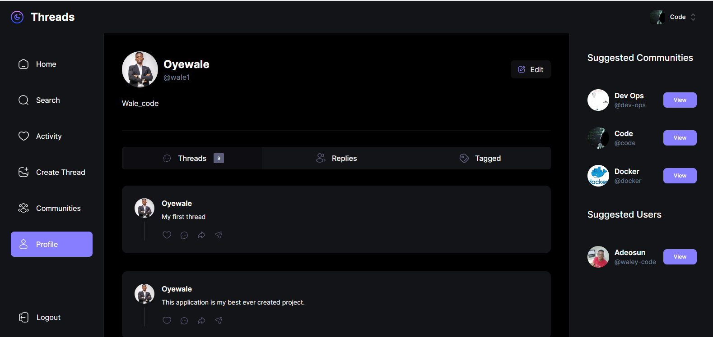

# Threads App Clone

Welcome to the Threads App Clone! This is a modern web application built using the latest features of Next.js 13, with a focus on seamless user experience, robust authentication, and interactive community engagement. The app empowers users to engage in discussions, share insights, and create vibrant communities. Threads App Clone leverages cutting-edge technologies to provide a feature-rich experience while ensuring mobile responsiveness and data security.

## Tech Stack

- **Front-End**: Next.js 13, React, TypeScript
- **Authentication**: Clerk (Sign up, Login, Onboarding)
- **Database**: MongoDB, Mongoose (ORM)
- **Deployment**: Vercel

## Features

- User Authentication:
  - Seamlessly sign up and log in using Clerk.
  - Guided user onboarding process for a smooth experience.

- Posts and Comments:
  - Create and share posts to initiate discussions.
  - Engage with other users by commenting on posts.

- Community Building:
  - Create communities to connect with like-minded individuals.
  - Add members to communities to foster engagement.

- User Profiles:
  - View and manage user profiles.
  - Upload profile images to personalize your presence.

- Mobile Responsiveness:
  - Enjoy a fully responsive design that adapts to various devices.

## Getting Started

1. Clone the repository: `git clone https://github.com/waley_code/threads-app.git`
2. Install dependencies: `npm install`
3. Set up Clerk authentication credentials.
4. Configure MongoDB connection in the app.
5. Run the development server: `npm run dev`
6. Access the app at `http://localhost:3000`

## Deployment

The app is deployed on Vercel and can be accessed at [https://your-app.vercel.app](https://your-app.vercel.app).

## Contributing

We welcome contributions to enhance the Threads App Clone. Feel free to open issues, submit pull requests, or provide feedback.

## Screenshots

Here's a sneak peek of the Threads App Clone:

## License

This project is licensed under the [MIT License](LICENSE).

---

Explore vibrant communities, engage in insightful discussions, and shape the future of your interests with Threads App Clone. Connect, collaborate, and converse!

---
